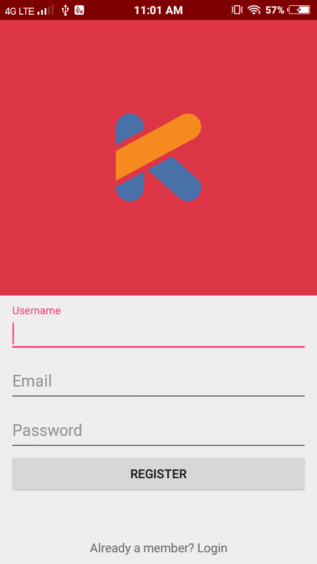

<b>Kotlin with SQLite Database</b>

This Tutorial have Few steps :

You can Read full Explanation and Documentation about how to implement this with Kotlin SQLite Database from Here:

# Setup
<b>Include in your project</b>

Android Studio 3.0 and higher

<b>Using Gradle </b>

Kotlin implementation in <b>build.gradle</b> file:

<pre>implementation "org.jetbrains.kotlin:kotlin-stdlib-jdk7:$kotlin_version"</pre>

<b>plugin</b> needs to add : 
<pre>
apply plugin: 'kotlin-android'
apply plugin: 'kotlin-android-extensions'
</pre>
update dependency in <b>module-level</b> build.gradle file :

<pre>classpath "org.jetbrains.kotlin:kotlin-gradle-plugin:$kotlin_version"</pre>

# Usage 

In this tutorial, we are going to learn how to use SQLite using Kotlin. To really understand the usage of SQLite we will create an app using Kotlin. The App contains simple Login form, Registration form. This app shows how SQLite database operations are performed. I assume that you have created a new android project.

ScreenShots of output :

